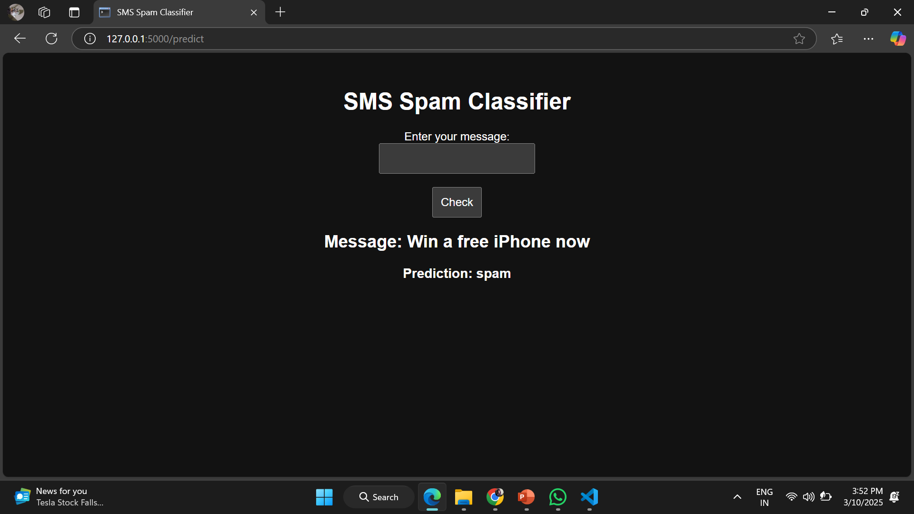

# 📩 Spam Mail Detection using Naïve Bayes (Flask App)

This project is a **Spam Mail Classifier** that identifies whether an SMS is **Spam** or **Ham (Not Spam)** using the **Multinomial Naïve Bayes algorithm**. The model is trained using **Scikit-learn**, and a **Flask web app** is built for users to enter messages and check if they are spam.

---

## 📌 Steps in the Code

### 1️⃣ **Import Required Libraries**
```python
from flask import Flask, render_template, request
import pickle
import pandas as pd
from sklearn.feature_extraction.text import CountVectorizer
from sklearn.naive_bayes import MultinomialNB
```
- `Flask` → Used to create the web application.  
- `pandas` → Load and process the dataset.  
- `CountVectorizer` → Convert text into numerical features.  
- `MultinomialNB` → Train the Naïve Bayes classifier.  
- `pickle` → Save and load the trained model.

---

### 2️⃣ **Load and Train the Spam Detection Model**
```python
df = pd.read_csv('train.csv')
vectorizer = CountVectorizer()
X_train_vec = vectorizer.fit_transform(df['sms'])
y_train = df['label']

model = MultinomialNB()
model.fit(X_train_vec, y_train)
```
- Loads the dataset from `train.csv`.  
- Converts SMS messages into numerical vectors using **CountVectorizer**.  
- Trains a **Multinomial Naïve Bayes** model on the dataset.  

---

### 3️⃣ **Save the Model and Vectorizer**
```python
with open('model.pkl', 'wb') as model_file:
    pickle.dump(model, model_file)

with open('vectorizer.pkl', 'wb') as vec_file:
    pickle.dump(vectorizer, vec_file)
```
- Saves the trained **ML model** and **vectorizer** using `pickle` so they can be reused later.  

---

### 4️⃣ **Create a Flask Web App**
```python
app = Flask(__name__)
```
- Initializes a Flask web application.

---

### 5️⃣ **Define Routes for Web Application**
#### 📌 **Home Page**
```python
@app.route('/')
def home():
    return render_template('index.html')
```
- Loads the HTML form where users can enter their message.

#### 📌 **Prediction Route**
```python
@app.route('/predict', methods=['POST'])
def predict():
    message = request.form['message']

    # Load the model and vectorizer
    with open('model.pkl', 'rb') as model_file:
        model = pickle.load(model_file)

    with open('vectorizer.pkl', 'rb') as vec_file:
        vectorizer = pickle.load(vec_file)

    # Transform input message
    message_vec = vectorizer.transform([message])

    # Make prediction
    prediction = model.predict(message_vec)[0]

    return render_template('index.html', message=message, prediction=prediction)
```
- Takes **user input** (SMS message) from the form.  
- Loads the **saved model and vectorizer**.  
- Transforms the message and **predicts whether it's Spam or Ham**.  
- Displays the result back on the webpage.

---

### 6️⃣ **Create the HTML Interface**
**File:** `templates/index.html`
```html
<!DOCTYPE html>
<html lang="en">
<head>
    <meta charset="UTF-8">
    <meta name="viewport" content="width=device-width, initial-scale=1.0">
    <title>SMS Spam Classifier</title>
    <style>
        body {
            font-family: Arial, sans-serif;
            text-align: center;
            margin: 50px;
        }
        input, button {
            padding: 10px;
            font-size: 16px;
        }
    </style>
</head>
<body>
    <h1>SMS Spam Classifier</h1>
    <form method="POST" action="/predict">
        <label for="message">Enter your message:</label><br>
        <input type="text" id="message" name="message" required><br><br>
        <button type="submit">Check</button>
    </form>

    
        <h2>Message: {{ message }}</h2>
        <h3>Prediction: <strong>{{ prediction }}</strong></h3>
    
</body>
</html>
```
- Simple UI where users can **enter a message** and **check if it's spam**.  
- Displays the **message and prediction** on the same page.  

---

### 7️⃣ **Run the Flask App**
```python
if __name__ == '__main__':
    app.run(debug=True)
```
- Starts the Flask server.  
- `debug=True` allows automatic reloading during development.

---
## 🖼️ Screenshot of the App
Here’s how the SMS Spam Classifier web app looks:



## 🎯 **Conclusion**
- This project **detects spam messages** using **Naïve Bayes classification**.  
- A **Flask web application** is built to allow users to check SMS messages.  
- **Pickle** is used to save and load the trained model for real-time predictions.  

---
